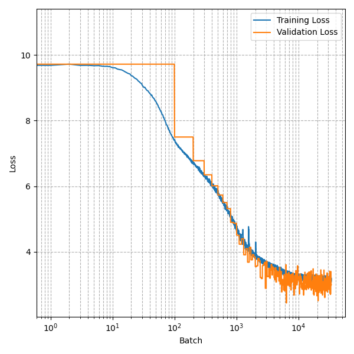
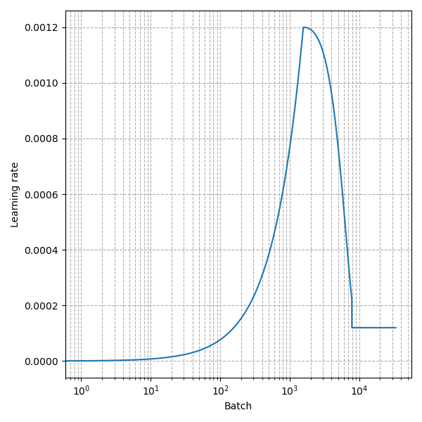

# SmollGPT

A toy implementation of a transformer LLM made for learning.

The goal with this repo is to build an LLM from scratch (scratch meaning Pytorch and [Karpathy videos](https://www.youtube.com/@AndrejKarpathy)).

## Goal

I wrote this repo primarily as an exercise. I tried to find out how far I would get with the [english-wikipedia](https://huggingface.co/datasets/lucadiliello/english_wikipedia) dataset from hugging face and few 10s of dollars on [Lambda Cloud](https://lambdalabs.com/service/gpu-cloud).

## How it works

The Pytorch model can be found in the `model` directory. It implements a transformer architecture inspired by the GPT-2 and GPT-3 papers. There is also a manual implementation of the attention mechanism intended to make it easy to grasp how it works, along with a faster implementation used for training.

The tokenizer used is [Tiktoken](https://github.com/openai/tiktoken) with the 50k vocabulary used for GPT-2.

The data is about 2B tokens of english wikipedia articles, which is about 5GB of data once tokenized and encoded as `uint16`. 

The training code can be found under the `training` directory. The training strategy is strongly inspired by the GPT-3 paper. It uses the AdamW optimizer and a cosine decay learning rate with a few warmup steps. It also makes use of gradient accumulation to simulate bigger batches then what can fit on a single H100. 

The data was pre-processed on my laptop and uploaded to S3 to then be downloaded on the GPU powered server. The training code logs various datapoints (loss, learning rate, tokens per seconds, ...) to a CSV file to analyze the training run. The `monitor.ipynb` notebook allowed me to graph the training run in real time during the training. 

## Results

I rented a H100 equipped server from Lambda Cloud and experimented with it for a bit. 

I settled on a configuration of around 130M parameters, with a context window of 1024 tokens, 768 embedding dimensions and 8 layers with 8 attention heads each.

The final training run went on for 8 hours, and read the whole of english wikipedia 4 times and a bit more. The model ended up with a training loss of around 3.15 to 3.20. It does not show obvious signs of overfitting when testing on the validation set.

The trained model learned to form decent english sentences, meaning it shows a decent level of coherence. It's knowledge and pertinence however is very poor. See the `Samples` section. 

**Training and validation loss throughout the training run**

**Learning rate schedule**

## Samples 
NOTE: This model is NOT trained to be an assistant, it can only complete sentences. 

**The capital of France is** Paris (1770–1872) – specializing only in the production of metal in Europe as a military and civilian camp. Her military commands have included Constituent IV and IV.

**Québec is best known for** its tennis courts. The tennis court was created in 1903 by King Louis XVI as a long-standing new residence for its members. The new home renovation in 1911 also came to be known as the Palais des bois, which comprises the Palais des Theatre, Florentine houses. In English, this was the first celebrations of long-distance tennis, and continued throughout World War II to the present days. The Palais des bois were gutterially replaced by the, noteworthy examples being a poster for the day in front of an I reign. Because this was deck banned from the Cotentin-Ars de Baladie in Canada, Churchill was commissioned to update and removed after the war to protect him from other nations of the world. At the Canadian War of Independence he committed suicide after a procedure foreseen by honoured veterans, including Stanislas Berg, Katarina Sócrates, Jacques Claver-Hugues, and Pierre Bertrand.

**The city of Québec is** located 60 km north of Montreal and about 30 km north of Montreal, on the border between western Quebec and Quebec. Quebec is surrounded by Montreal proper and northeast of Montreal and north of Montreal. The city of Montreal is also the administrative center, and is part of a larger Metropolitan Municipality.

**The city of Montréal** is in the "comune of Montréal and in the Regency of Montreux-Rousseilles"

**Donkey kong is** a nonexistent early January nursery rhyme with a date that commemorates the occasion of death of the child when Evan is about to leave Chicago on the train to Greenport on an isolated Bardia test, and traveling narcissistically in green umbrellas.

**Game of thrones character Tirion Lannister** is teamed with Max at the famous Frankford Place nightclub in Ealing.

**What is the meaning of life? The meaning of life is** Christ. This is the form of life, its nature, its living time, and the action of dependence. Wife is a act of revenge and the law is changing from creation to death to death.

**Shrek is and always will be** depressed under the weight of excessive food products.

**The capital of the USA is** the city of Dallas, Texas, and had a population of 71 as of the 2010 U.S. census. 
